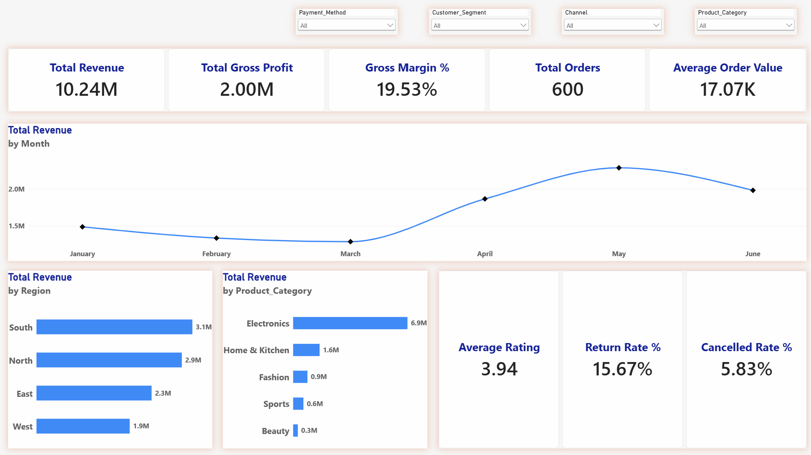

# E-commerce Sales Dashboard

## Overview

An interactive **E-commerce Performance Dashboard** designed to provide a quick executive view of sales, profitability, orders, customer performance, and operational metrics.

## Key Metrics

- **Total Revenue:** 10.24M
- **Total Gross Profit:** 2.00M
- **Gross Margin:** 19.53%
- **Total Orders:** 600
- **Average Order Value:** 17.07K
- **Average Rating:** 3.94
- **Return Rate:** 15.67%
- **Cancelled Rate:** 5.83%

## Dashboard Insights

- **Monthly Revenue:** Revenue declined during February–March before recovering strongly in April and reaching its peak in May.
- **Regional Performance:** South leads revenue contribution, followed by North, East, and West.
- **Product Performance:** Electronics is the dominant category, generating significantly higher revenue than Home & Kitchen, Fashion, Sports, and Beauty.
- **Customer & Order Health:** The dashboard tracks order value, ratings, returns, and cancellations to provide a balanced view of both growth and operational performance.

## Interactive Filters

Users can dynamically analyze performance using:

- Payment Method
- Customer Segment
- Channel
- Product Category

## Purpose

The dashboard is designed to help **business leaders and e-commerce teams** quickly identify revenue trends, high-performing regions and categories, and potential areas for improvement in customer experience and order operations.
